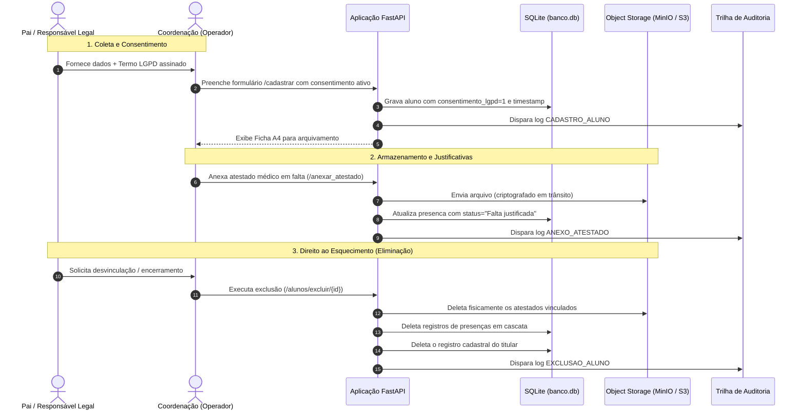

# 🏛 Manual de Arquitetura e Governança LGPD

Este documento descreve detalhadamente as decisões arquiteturais, o modelo de segurança e as salvaguardas implementadas no sistema da **Casa de Lió (ADRA)** para atendimento integral à **Lei Geral de Proteção de Dados Pessoais (Lei nº 13.709/2018 - LGPD)**.

---

## 1. Mapeamento de Dados Sensíveis e Base Legal

A instituição Casa de Lió atua com educação socioassistencial, tratando duas categorias de altíssima sensibilidade jurídica:

### 1.1 Dados de Crianças e Adolescentes (Art. 14 da LGPD)
* **Regra Legal:** O tratamento de dados pessoais de crianças e adolescentes deve ser realizado em seu melhor interesse e mediante consentimento específico e em destaque dado por pelo menos um dos pais ou pelo responsável legal.
* **Salvaguardas no Sistema:**
  * Formulário de cadastro (`/cadastrar`) exige a identificação do responsável legal (`nome_responsavel`) e a marcação ativa da caixa de consentimento (`consentimento_lgpd = 1`).
  * O sistema registra no banco a estampa de tempo exata em formato ISO (`data_consentimento`) com segundos.
  * O sistema gera a folha A4 oficial (`/ficha/{id}`) com a declaração expressa de consentimento e tratamento para arquivo físico com assinatura presencial do responsável.

### 1.2 Dados Pessoais Sensíveis de Saúde (Art. 5º, II da LGPD)
* **Regra Legal:** Informações sobre saúde, condições médicas e atestados são dados sensíveis cujo tratamento exige proteção redobrada contra acessos não autorizados.
* **Salvaguardas no Sistema:**
  * O campo `condicao_medica` é visível exclusivamente na ficha interna do aluno e na tela de edição restrita à coordenação.
  * Os atestados médicos (PDFs/Imagens) armazenados não ficam expostos em diretórios estáticos públicos.
  * O acesso aos arquivos anexados passa obrigatoriamente pelo endpoint `/uploads/{nome_arquivo}`, que valida a autenticação JWT do operador antes de permitir a entrega do arquivo ou o redirecionamento.

---

## 2. Trilha de Auditoria e Prestação de Contas (Art. 37 & 46)

Para cumprir o princípio da responsabilização e prestação de contas (*accountability*), foi implementada uma tabela permanente e imutável de logs no banco de dados:

```sql
CREATE TABLE IF NOT EXISTS logs_auditoria (
    id INTEGER PRIMARY KEY AUTOINCREMENT,
    usuario TEXT NOT NULL,
    acao TEXT NOT NULL,
    alvo TEXT,
    data_hora TEXT NOT NULL
);
```

### 2.1 Eventos Monitorados

| Ação Registrada | Quando Ocorre? | O que é gravado no campo `alvo`? |
| :--- | :--- | :--- |
| `CADASTRO_ALUNO` | Conclusão de nova matrícula | Nome do aluno, ID gerado e turma vinculada |
| `EDICAO_ALUNO` | Alteração de dados cadastrais | Nome e ID do aluno atualizado |
| `EXCLUSAO_ALUNO` | Eliminação cadastral (Direito ao Esquecimento) | Nome do titular e ID do registro removido |
| `ANEXO_ATESTADO` | Upload de documento médico de falta | ID do aluno, data da falta e nome do arquivo seguro |
| `CRIACAO_USUARIO`| Adição de novo operador do sistema | Login do novo operador e perfil de privilégio concedido |

### 2.2 Painel de Auditoria (`/auditoria`)
* Acesso restrito a usuários com perfil `coordenacao`. Usuários comuns ou professores são redirecionados automaticamente.
* Apresenta os últimos 100 eventos ordenados de forma decrescente com etiquetas temáticas:
  * 🟢 **Verde:** Cadastros e criações.
  * 🟡 **Amarelo:** Atualizações cadastrais.
  * 🔵 **Azul:** Laudos e atestados médicos.
  * 🔴 **Vermelho:** Descarte e eliminação de registros.

---

## 3. Ciclo de Vida do Dado Pessoal (Lifecycle)



---

## 4. Estratégia de Armazenamento de Arquivos: MinIO / AWS S3

O módulo `storage.py` desacopla o armazenamento de arquivos da aplicação FastAPI:

### 4.1 Por Que Não Usar Servidor Estático Simples?
Em servidores web tradicionais, pastas como `/static/uploads` são abertas: qualquer pessoa com o link direto consegue abrir a imagem de um atestado médico contendo CRM do médico, diagnóstico e dados pessoais de uma criança.

### 4.2 A Abordagem Segura (Presigned URLs)
No modo S3/MinIO:
1. Os arquivos residem em um bucket privado.
2. Quando a coordenação clica em visualizar o atestado, a aplicação valida que o operador está logado.
3. A aplicação solicita ao MinIO/S3 a geração de uma **URL temporária pré-assinada criptograficamente** (válida por apenas 60 minutos):
   ```python
   url = cliente.generate_presigned_url(
       "get_object",
       Params={"Bucket": "casa-de-lio-uploads", "Key": nome_arquivo},
       ExpiresIn=3600
   )
   ```
4. O navegador do operador é redirecionado via HTTP 307 para o arquivo.
5. Após 60 minutos, a URL expira e torna-se inútil para terceiros.

---

## 5. Modelo de Defesa em Profundidade (Segurança)

1. **Tokens JWT com Cookies `HttpOnly`:** 
   O token não é acessível por `document.cookie` no console do navegador, eliminando o vetor principal de roubo de credenciais via XSS.
2. **Hashes `bcrypt` Lentos:**
   Dificulta ataques de força bruta offline em caso de vazamento da base SQLite.
3. **Isolamento de Variáveis em `.env`:**
   A `SECRET_KEY` da aplicação nunca é versionada no repositório Git.
4. **Proxy Reverso com Nginx:**
   O container FastAPI não fica exposto diretamente à rede pública; o Nginx gerencia buffer de conexão, timeouts e controle de tráfego.
